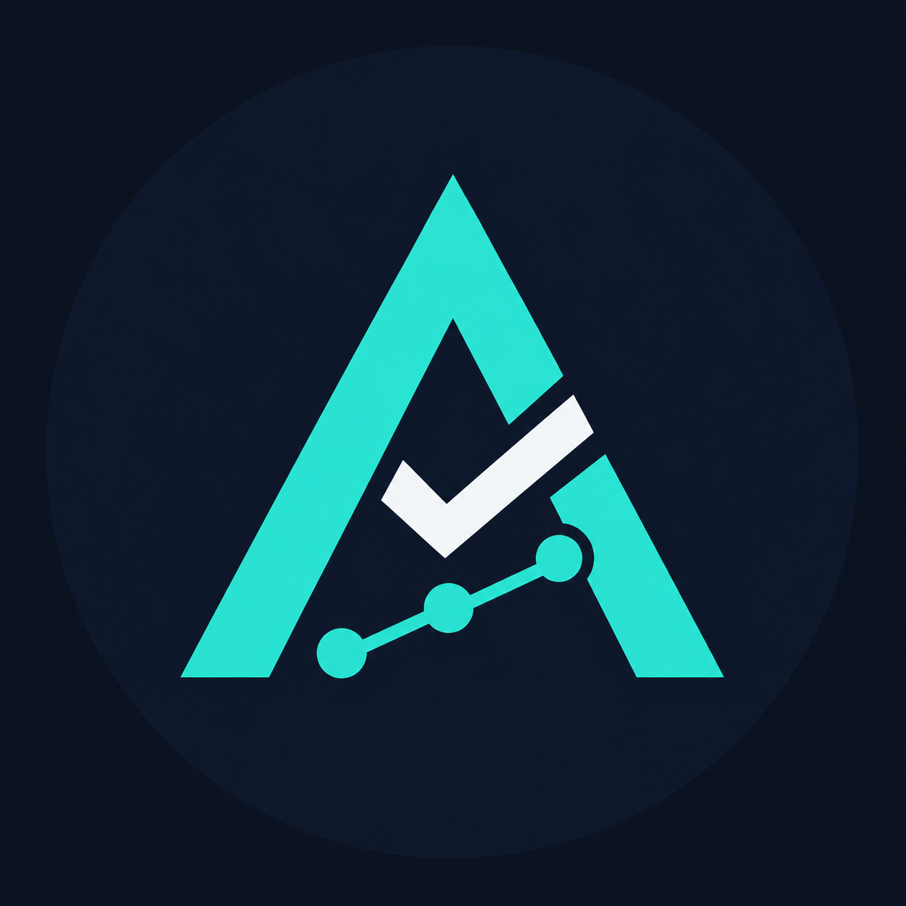

# AlgoProof Lab

**Verified Trading Bots & Strategies**



Публичная доказательная база проверяемых self-hosted ботов и торговых стратегий. Первый продукт предназначен для рынков Bitcoin Up/Down 5m на Polymarket.

Этот репозиторий содержит отчёты, примеры сделок, документацию, историю версий и правила проверки продукта. Код продаваемой стратегии и клиентская сборка здесь не публикуются.

## Реальная торговля лаборатории

Период текущего непрерывного LIVE-журнала: **15 сентября — 7 октября 2026 года**.

| Показатель | Значение |
|---|---:|
| Завершённых реальных сделок | 469 |
| Сделок в плюс / минус | 271 / 198 |
| Доля прибыльных сделок | 57,78% |
| Итог после комиссий | **+485,82 USDC** |

В этот период лаборатория проверяла несколько стратегий. Поэтому это подтверждённый результат реального лабораторного счёта в целом, а не заявленный результат одного продаваемого пакета. [Подробности и дата снимка](docs/LIVE_TRADING_RU.md).

## Историческая проверка первого продукта: SALEBOT-5M-BR72

Период исследования: **4 августа — 4 октября 2026 года**.

| Показатель | Значение |
|---|---:|
| Закрытых рынков в исходной выборке | 17 564 |
| Расчётных сделок стратегии | 471 |
| Прибыльных исходов | 56,26% |
| Результат при фиксированной ставке 1 USDC | +30,02 USDC |
| Максимальная расчётная просадка | 9,35 USDC |
| Стресс-тест с удвоенным проскальзыванием | +25,18 USDC |

### Пересчёт того же журнала для разных ставок

| Ставка на сделку | Расчётный результат | Расчётная максимальная просадка |
|---:|---:|---:|
| 20 USDC | +600,40 USDC | 187 USDC |
| 40 USDC | +1 200,80 USDC | 374 USDC |
| 100 USDC | +3 002 USDC | 935 USDC |
| 400 USDC | +12 008 USDC | 3 740 USDC |

Это линейный пересчёт тех же 471 исторических сигналов. Стандартная лицензия сейчас ограничена ставкой 100 USDC; строка 400 USDC добавлена для оценки масштаба и требует отдельной проверки исполнения по стакану.

## Что можно проверить

- [Реальная торговля лаборатории с 15 сентября](docs/LIVE_TRADING_RU.md)
- [Ежедневная статистика LIVE-счёта](docs/DAILY_STATS_RU.md)
- [Варианты доступа и автоматическая смена стратегий](docs/PRODUCT_ACCESS_RU.md)
- [Подробный отчёт](docs/BR72_REPORT_RU.md)
- [Краткая сводка в JSON](data/BR72_PUBLIC_SUMMARY.json)
- [Пример строк из журнала](data/BR72_SAMPLE_TRADES.csv)
- [Как считался результат](docs/METHODOLOGY_RU.md)
- [Безопасность клиентских данных](SECURITY.md)
- [Как выглядит установка](docs/INSTALLATION_OVERVIEW_RU.md)
- [Жизненный цикл стратегий](docs/STRATEGY_LIFECYCLE_RU.md)
- [Частые вопросы](docs/FAQ_RU.md)
- [История версий](CHANGELOG.md)
- [Контрольные суммы выпусков](docs/RELEASES_RU.md)

## Что получает покупатель

- готовую self-hosted сборку;
- мастер первоначальной настройки;
- управление и уведомления через собственного Telegram-бота;
- демонстрационный режим без отправки заявок;
- реальный режим с ограничением ставки и дневного убытка;
- пробную лицензию на 48 часов;
- подробную инструкцию от аренды VPS до запуска;
- поддержку установки;
- фиксированную стратегию без срока или автоматические изменения стратегий по подписке.

Все торговые секреты покупатель вводит только на своём VPS. Продавец не запрашивает и не хранит приватный ключ, seed-фразу, API secret, Telegram-токен или пароль от сервера.

## Оплата

Доступны два продукта:

- **200 USD** — бот и одна закреплённая стратегия без срока;
- **400 USD** — бот и автоматические изменения стратегий в течение 30 дней;
- **200 USD** — продление автоматических изменений ещё на 30 дней.

Если подписку не продлевать, бот продолжает работать на последней полученной стратегии.

Есть два способа оплаты:

1. **Внутри Telegram — Telegram Stars.** Покупатель оформляет заказ через [@algoproof_shop_bot](https://t.me/algoproof_shop_bot), оплачивает выставленный счёт и получает лицензию после подтверждения платежа Telegram.
2. **Вне Telegram — USDT по реквизитам, опубликованным на этой странице GitHub.** Перед переводом напишите [@algoproof_support](https://t.me/algoproof_support), получите номер заказа и точную сумму.

Реквизиты USDT, проверенные в Walt 7 октября 2026 года:

- сеть **TON**: `UQB9Y_Is2Xd2Sqarltgnh55rSkZ1tyBN9VhrDAb9Sr-vqYAT`;
- сеть **Tron (TRC20)**: `TPXukusuPbG7TrMdwY7NMVZfHnWnstPFDC`.

Отправляйте только USDT и только по выбранной сети. После перевода пришлите поддержке номер заказа и хеш транзакции (TXID). GitHub не принимает и не обрабатывает оплату — он используется как публичная страница с проверяемыми реквизитами. Никому не отправляйте приватный ключ, seed-фразу или пароль от кошелька.

## Статус

```text
Продукт: SALEBOT-5M-BR72
Версия: 1.0.0
Статус стратегии: ACTIVE
Публичная проверка: подготовлена
Продажи: закрытая бета
```

Публичный Telegram-канал: [@algoprooflab](https://t.me/algoprooflab).

Бот-магазин: [@algoproof_shop_bot](https://t.me/algoproof_shop_bot).

Канал, репозиторий, бот-магазин и поддержка уже активны.
